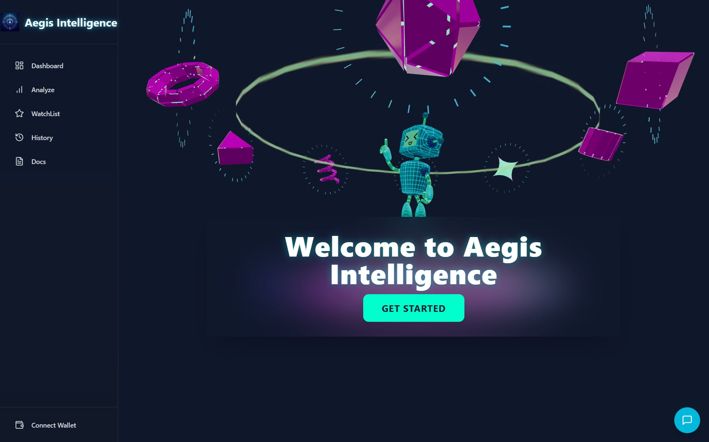
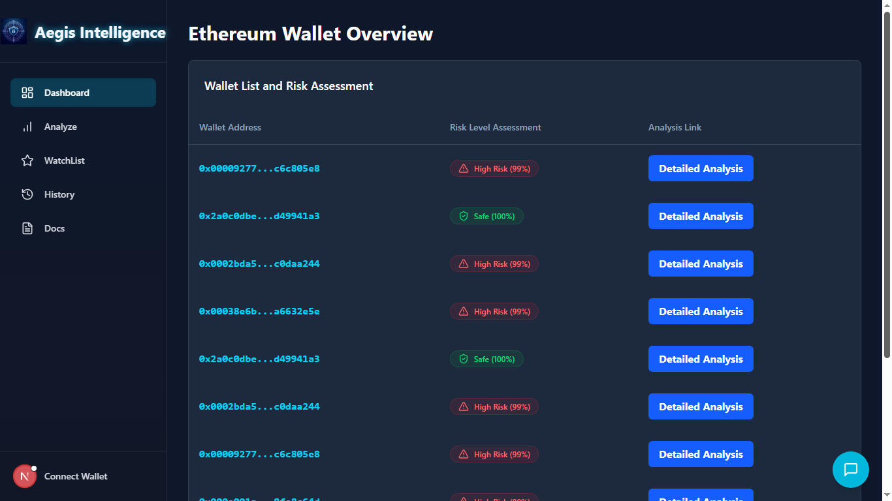
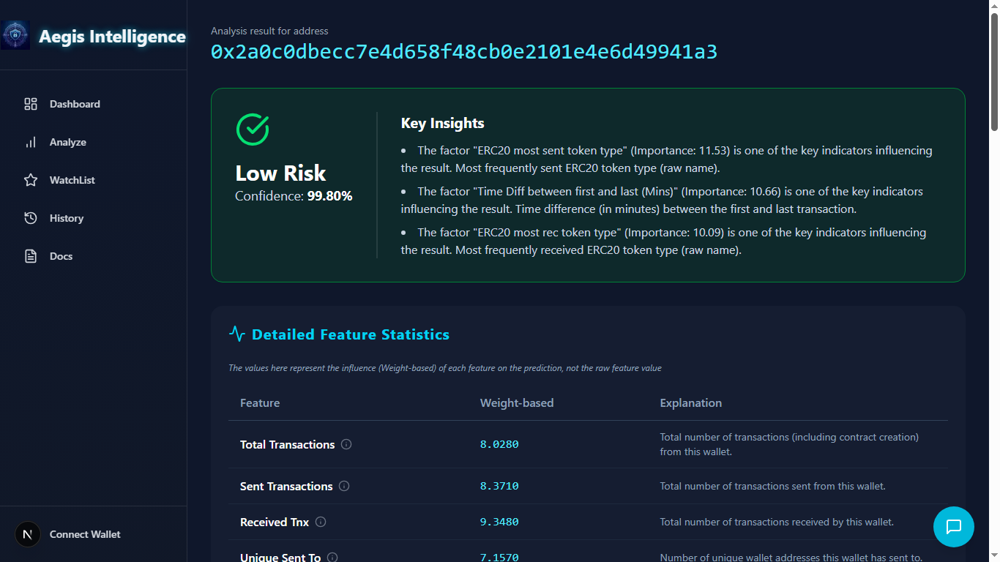

*An AI-powered On-chain Risk Analysis and Prediction System, developed for the UEL Attacker 2025 competition.*

---

## 🚀 Introduction

In the burgeoning landscape of digital assets, identifying the safety and risk levels of blockchain entities (wallets, smart contracts, transactions) has become more complex and critical than ever. **NovaLedger** emerges with the mission of bringing transparency and security to users within the Ethereum ecosystem by providing an intelligent, intuitive, and robust on-chain analysis platform.

This project employs an end-to-end data processing pipeline, from raw on-chain data collection and enrichment to the application of advanced machine learning models, delivering highly accurate risk predictions.

## ✨ Key Features

NovaLedger is built around three core pages, creating a seamless and focused user experience:

#### 1. **Homepage - On-chain Intelligence Hub** (`HomePage`)
- **Purpose:** Serves as the primary gateway to the entire system, focused on a single action: initiating an investigation.
- **Features:**
    - A large, prominent search bar allowing users to input any wallet address, transaction hash (TxHash), or ENS domain.
    - Displays real-time Ethereum network parameters, creating a sense of a "live" and dynamic tool.



#### 2. **Dashboard - Ethereum Monitoring Station** (`DashboardPage`)
- **Purpose:** Provides a "control room" for in-depth users, offering a comprehensive overview of ongoing risky activities across the network.
- **Features:**
    - Visual charts that illustrate risk trends over time and categorize various types of on-chain activities.
    - A continuously updated list of suspicious transactions, allowing users to click for detailed analysis.



#### 3. **Analysis Page - Deep Dive Forensics View** (`AnalysisPage`)
- **Purpose:** This is the "heart" of the product, displaying detailed analysis results after a user performs a search.
- **Features:**
    - **Risk Gauge Chart:** Visualizes the overall risk score (from 0-100).
    - **Risk Factors:** Lists detailed reasons why an address or transaction is considered risky, powered by Explainable AI.
    - **Interactive Network Graph:** A visual diagram of the relationships and interactions of the analyzed entity with other wallets and contracts.



Additionally, NovaLedger includes:
*   **Watchlist:** Allows users to monitor specific addresses over time for changes in risk profile.
*   **History:** Provides a record of past analysis requests.
*   **Docs Page (`DocsPage.png`):** Offers comprehensive documentation, usage guides, and technical explanations of the system's underlying mechanisms.
*   **Connect Wallet:** Functionality to connect the user's Web3 wallet for personalized features.

## 🛠️ Technologies Used

*   **Frontend:**
    *   **Next.js:** React framework for building full-stack applications, supporting Server-Side Rendering (SSR) and API Routes.
    *   **React:** JavaScript library for building user interfaces.
    *   **TypeScript:** Superset of JavaScript for type safety and improved developer experience.
    *   **Tailwind CSS:** Utility-first CSS framework for rapid and highly customizable UI design.
    *   **Lucide-React:** A collection of beautiful and lightweight SVG icons.

*   **Backend & API:**
    *   **Python (FastAPI):** A modern, fast (high-performance) web framework for building APIs for the Machine Learning models.
    *   **Uvicorn:** ASGI server for running FastAPI applications.
    *   **Pydantic:** Data validation and settings management for Python using type hints.
    *   **httpx:** A fully featured HTTP client for Python, used for making asynchronous requests to external APIs.
    *   **Next.js API Routes:** Acts as a Backend-for-Frontend (BFF) layer, securely proxying requests from the frontend to the Python FastAPI backend and processing responses.

*   **Data & AI:**
    *   **Covalent API:** A third-party service for fetching raw on-chain data from Ethereum.
    *   **Python (Pandas, NumPy):** Used for data manipulation, cleaning, and Feature Engineering.
    *   **PyTorch / PyTorch Geometric:** Deep learning frameworks for building and training advanced fraud prediction models (specifically Graph Neural Networks).
    *   **scikit-learn / joblib:** Libraries for traditional machine learning models and efficient model serialization/deserialization.

*   **Graph Visualization:**
    *   **PyVis:** Python library for interactive network visualization (integrated via FastAPI).

*   **Notifications:**
    *   **Telegram Bot API:** For sending automated alerts.

## 🌊 Detailed Project Flow

NovaLedger's processing flow exemplifies a modern AI system, integrating multiple services to deliver comprehensive analysis results.

**Step-by-step breakdown:**

1.  **Initiation (Homepage):**
    *   The user enters a wallet address into the search bar and clicks "Analyze".

2.  **Navigation (Frontend - Next.js):**
    *   The frontend uses Next.js's `useRouter` to navigate the user to the dynamic analysis page, e.g., `/analysis/0x...`.

3.  **Analysis Request (Frontend -> Next.js API Route):**
    *   The `AnalysisPage` is rendered. Its client-side component (e.g., `DashboardClient` or an `AnalysisClient` internally) sends an asynchronous `POST` request to the project's internal Next.js API route: `/api/analyze`. This request contains the wallet address to be analyzed.

4.  **Secure Proxy & Orchestration (Next.js API Route -> FastAPI Backend):**
    *   The Next.js API route (`src/app/api/analyze/route.ts`) receives the request. This is where the secure and complex logic orchestrates the backend communication:
        *   **4a. Data Retrieval (FastAPI calls Covalent):** The Next.js API route forwards the request to your deployed Python FastAPI backend (e.g., `https://graph-based-ethereum-fraud-detection.onrender.com/analyze` and `/explain`). The FastAPI backend then uses your `COVALENT_API_KEY` to call the Covalent API, requesting all relevant on-chain data for the given wallet address.
        *   **4b. Feature Engineering (FastAPI):** The FastAPI server processes the raw JSON data received from Covalent, extracting and calculating the necessary features (e.g., 50 features) required by the AI model.
        *   **4c. AI Model Prediction (FastAPI):** The FastAPI server feeds these engineered features into its loaded ML model (running in the same FastAPI process) for fraud prediction and explanation.
        *   **4d. Structured Response (FastAPI to Next.js API Route):** The FastAPI server returns the prediction results (e.g., status, confidence, percent) and feature explanations (e.g., `feature_importance`) as structured JSON back to the Next.js API route.

5.  **Result Delivery (Next.js API Route -> Frontend):**
    *   The Next.js API route receives the combined results from FastAPI and sends them back to the user's browser as a single JSON object.

6.  **Display (Frontend):**
    *   The client-side component (e.g., `AnalysisClient`) receives the JSON results, updates its state, and renders the `SummaryPanel` (risk assessment, key insights), `StatsPanel` (detailed feature statistics), and `GraphDisplay` (interactive network visualization) for the user.
    *   For specific high-risk addresses (e.g., `SCAM_WALLET_ADDRESS`), a Telegram alert is dispatched.

## ⚡ Installation & Running the Project

1.  **Clone the repository:**
    ```bash
    git clone https://github.com/pexa8335/Graph-based_Ethereum_Fraud_Detection.git
    cd Graph-based_Ethereum_Fraud_Detection
    ```

2.  **Frontend Setup (NovaLedger UI)**

    a. **Navigate to the frontend directory:**
    ```bash
    cd FE_Novaledger
    ```

    b. **Create environment file:**
    - Create a file named `.env.local` in the `FE_Novaledger` root directory.
    - Add the necessary environment variables:
      ```env
      NEXT_PUBLIC_APP_URL=http://localhost:3000
      GRAPHAPI_URL=https://your-graph-url.com # Your deployed Graph Analysis API URL
      NEXT_PUBLIC_FASTAPI_BASE_URL=https://your-rag-chatbot.onrender.com # Your deployed RAG Chatbot API URL
      ```

    c. **Install dependencies:**
    ```bash
    npm install # or yarn install
    ```

    d. **Run the development server:**
    ```bash
    npm run dev # or yarn dev
    ```
    The frontend application will be accessible at `http://localhost:3000`.

3.  **Backend Setup (FastAPI & ML Models)**

    a. **Navigate to the backend API directory:**
    ```bash
    cd Model/API_Handling
    ```

    b. **Create environment file:**
    - Create a file named `.env` in the `Model/API_Handling` directory.
    - Add the necessary environment variables:
      ```env
      COVALENT_API_KEY=YOUR_COVALENT_API_KEY_HERE # Obtain from CovalentHQ
      TELEGRAM_BOT_TOKEN=YOUR_TELEGRAM_BOT_TOKEN # Your Telegram Bot token
      TELEGRAM_CHAT_ID=YOUR_TELEGRAM_CHAT_ID # Your Telegram Chat ID for alerts
      ```
    **Important:** `COVALENT_API_KEY` is crucial for data retrieval. Ensure it's valid and has sufficient quota.

    c. **Install Python dependencies:**
    ```bash
    pip install -r requirements.txt
    ```
    *(If you don't have a `requirements.txt` in this directory, you'll need to create one by running `pip freeze > requirements.txt` in your activated virtual environment after installing all necessary packages like `fastapi`, `uvicorn`, `pandas`, `numpy`, `scikit-learn`, `torch`, `torch_geometric`, `joblib`, `httpx`, `python-dotenv`, `shap`, etc.)*

    d. **Ensure Model Artifacts are in place:**
    Verify that `preprocessing_pipeline.pkl`, `metadata.json`, and `fraud_gnn_weights.pth` are located in the `../Model/` directory relative to `app.py`. These files are essential for the ML model's operation.

    e. **Run the FastAPI server:**
    ```bash
    uvicorn app:app --host 0.0.0.0 --port 8000 --reload
    ```
    The FastAPI backend will be accessible at `http://localhost:8000`.

4.  **RAG Chatbot Setup (if separate service, refer to its own documentation)**

    *(If your RAG Chatbot is a separate service, refer to its specific setup instructions. Ensure its API is running and accessible at the URL configured in `FE_Novaledger/.env.local`.)*

## 🧑‍💻 Usage

1.  **Start both the Frontend and Backend servers.**
2.  Open your web browser and navigate to `http://localhost:3000`.
3.  **Homepage:** Enter an Ethereum wallet address (e.g., `0x00009277775ac7d0d59eaad8fee3d10ac6c805e8`) into the search bar to initiate an analysis.
4.  **Dashboard:** Navigate to the Dashboard page to see an overview of mock wallets with their risk assessments. Click "Detailed Analysis" for more information on each.
5.  **Analyze Page:** View detailed risk predictions, key insights from the AI, granular feature statistics, and interactive graph visualizations for a specific address.
6.  **Docs Page:** Explore the comprehensive documentation for a deeper understanding of the system.

## 📸 Screenshots

Screenshots of the main pages are available in the `public/` directory, illustrating the user interface and key functionalities:
*   `AnalysisPage.png`
*   `DashboardPage.png`
*   `HomePage.jpg`
*   `DocsPage.png`

## ✨ Technologies Used

*   **Frontend:** Next.js, React, TypeScript, Tailwind CSS, Lucide React Icons
*   **Backend (FastAPI):** Python, FastAPI, Uvicorn, Pydantic, httpx
*   **Machine Learning:** PyTorch, PyTorch Geometric, scikit-learn, joblib, pandas, numpy
*   **Graph Visualization:** PyVis (integrated via FastAPI)
*   **Blockchain Data:** CovalentHQ API
*   **Notifications:** Telegram Bot API
*   **Deployment:** Render.com (as per your `.env` for deployed services)

## 🤝 Contributing

Contributions are welcome! Please feel free to open issues, submit bug reports, or propose new features via pull requests.

## 📄 License

This project is licensed under the MIT License. See the `LICENSE` file for details.
