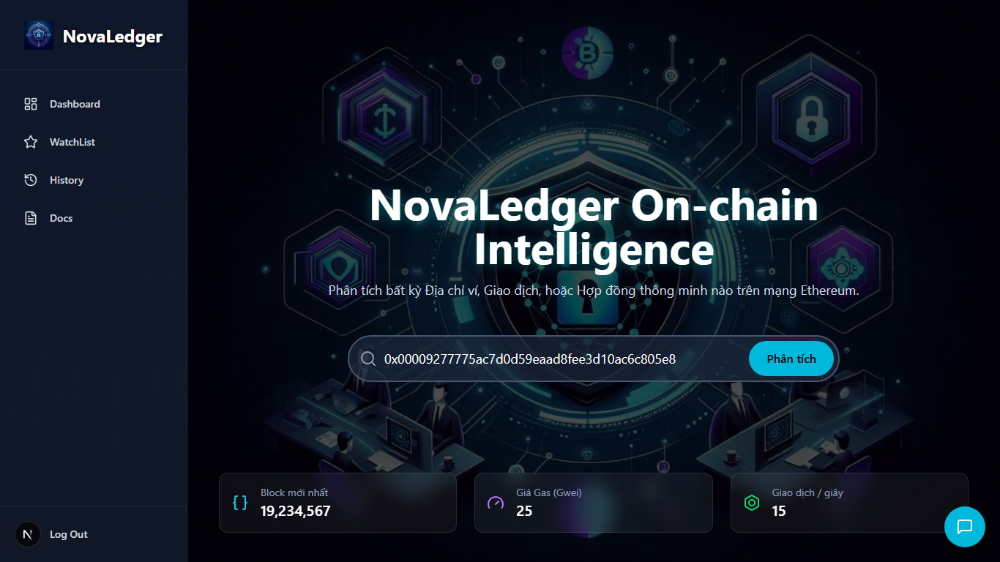

# NovaLedger - On-chain Intelligence Platform
*Hệ thống phân tích và dự đoán rủi ro On-chain ứng dụng Trí tuệ nhân tạo, được phát triển cho cuộc thi UEL Attacker 2025.*

---

## 🚀 Giới thiệu

Trong bối cảnh bùng nổ của tài sản kỹ thuật số, việc xác định mức độ an toàn và rủi ro của các thực thể trên blockchain (ví, hợp đồng thông minh, giao dịch) trở nên phức tạp và cấp thiết hơn bao giờ hết. **NovaLedger** ra đời với sứ mệnh mang đến sự minh bạch và an toàn cho người dùng trong hệ sinh thái Ethereum bằng cách cung cấp một nền tảng phân tích on-chain thông minh, trực quan và mạnh mẽ.

Dự án này ứng dụng một luồng xử lý dữ liệu end-to-end, từ việc thu thập dữ liệu thô on-chain, làm giàu dữ liệu, cho đến việc áp dụng mô hình học máy để đưa ra những dự đoán rủi ro có độ chính xác cao.

## ✨ Tính năng nổi bật

NovaLedger được xây dựng xoay quanh 3 trang chính, tạo nên một trải nghiệm người dùng liền mạch và tập trung:

#### 1. **Trang chủ - On-chain Intelligence Hub** (`HomePage`)
- **Mục đích:** Là cổng vào của toàn bộ hệ thống, tập trung vào một hành động duy nhất: khởi tạo một cuộc điều tra.
- **Tính năng:**
    - Một thanh tìm kiếm lớn, nổi bật cho phép người dùng nhập vào bất kỳ địa chỉ ví, mã giao dịch (TxHash), hoặc tên miền ENS nào.
    - Hiển thị các thông số real-time của mạng lưới Ethereum, tạo cảm giác đây là một công cụ "sống".


#### 2. **Trang tổng quan - Ethereum Monitoring Station** (`DashboardPage`)
- **Mục đích:** Cung cấp một "phòng điều khiển" cho người dùng chuyên sâu, hiển thị bức tranh toàn cảnh về các hoạt động rủi ro đang diễn ra trên mạng lưới.
- **Tính năng:**
    - Các biểu đồ trực quan hóa xu hướng rủi ro theo thời gian và phân loại các loại hoạt động on-chain.
    - Một danh sách các giao dịch đáng ngờ được cập nhật liên tục, cho phép người dùng click vào để xem phân tích chi tiết.


#### 3. **Trang phân tích - Deep Dive Forensics View** (`AnalysisPage`)
- **Mục đích:** Đây là "trái tim" của sản phẩm, nơi hiển thị kết quả phân tích chi tiết sau khi người dùng thực hiện tìm kiếm.
- **Tính năng:**
    - **Biểu đồ Gauge:** Trực quan hóa điểm số rủi ro tổng thể (từ 0-100).
    - **Các yếu tố rủi ro:** Liệt kê chi tiết các lý do tại sao một địa chỉ hoặc giao dịch lại bị coi là rủi ro.
    - **Sơ đồ mạng lưới tương tác:** Một biểu đồ trực quan hóa các mối quan hệ và tương tác của đối tượng đang được phân tích với các ví và hợp đồng khác.


## 🛠️ Công nghệ sử dụng

- **Frontend:**
    - **Next.js:** Framework React cho các ứng dụng full-stack, hỗ trợ Server-Side Rendering (SSR) và API Routes.
    - **React:** Thư viện xây dựng giao diện người dùng.
    - **Tailwind CSS:** Framework CSS cho việc thiết kế nhanh chóng và tùy biến cao.
    - **Lucide-React:** Bộ icon đẹp và nhẹ.

- **Backend & API:**
    - **Next.js API Routes:** Hoạt động như một tầng Backend-for-Frontend (BFF), đóng vai trò "trạm trung chuyển" an toàn cho các yêu cầu.
    - **Flask (Python):** Framework để xây dựng và triển khai API cho mô hình Machine Learning.

- **Data & AI:**
    - **Covalent API:** Dịch vụ của bên thứ ba để lấy dữ liệu on-chain thô từ Ethereum.
    - **Python (Pandas, NumPy):** Được sử dụng để xử lý, làm sạch dữ liệu và thực hiện Feature Engineering.
    - **Scikit-learn / TensorFlow / PyTorch:** Các thư viện để xây dựng và huấn luyện mô hình dự đoán rủi ro.

## 🌊 Luồng hoạt động chi tiết (Project Flow)

Luồng xử lý của NovaLedger là một ví dụ điển hình của một hệ thống AI hiện đại, kết hợp nhiều dịch vụ để đưa ra kết quả cuối cùng.

**Chi tiết các bước:**

1.  **Khởi tạo (Trang chủ):**
    - Người dùng nhập một địa chỉ ví vào thanh tìm kiếm và bấm "Phân tích".

2.  **Điều hướng (Frontend):**
    - Frontend sử dụng `useRouter` của Next.js để điều hướng người dùng đến trang phân tích động, ví dụ: `/analysis/0x...`.

3.  **Yêu cầu Phân tích (Frontend):**
    - Trang `AnalysisPage` được render. Component `AnalysisClient` bên trong nó sẽ dùng `useEffect` để gửi một yêu cầu `POST` đến API nội bộ của chính dự án: `/api/analysis`. Yêu cầu này chứa địa chỉ ví cần phân tích.

4.  **Trạm trung chuyển an toàn (Backend - Next.js API Route):**
    - File `src/app/services` nhận yêu cầu. Đây là nơi toàn bộ logic phức tạp diễn ra một cách an toàn trên server.
    - **Bước 4a - Lấy dữ liệu thô:** Server Next.js sử dụng API Key của Covalent (được lưu an toàn trong biến môi trường) để gọi đến API của Covalent, yêu cầu tất cả dữ liệu liên quan đến địa chỉ ví kia.
    - **Bước 4b - Feature Engineering:** Server xử lý khối dữ liệu JSON khổng lồ từ Covalent, rút trích và tính toán để tạo ra đúng **50 feature** mà mô hình AI yêu cầu.
    - **Bước 4c - Gọi Model AI:** Server gửi 50 feature này đến API `/predict` (chạy trên port 5000) do Flask cung cấp.
    - **Bước 4d - Nhận dự đoán:** Server Flask trả về kết quả dự đoán (ví dụ: `{ "prediction": 1, "confidence": 0.912 }`) cho server Next.js.

5.  **Trả kết quả về Frontend:**
    - API Route của Next.js nhận kết quả từ Flask và gửi nó về lại cho trình duyệt dưới dạng một object JSON.

6.  **Hiển thị (Frontend):**
    - Component `AnalysisClient` nhận được JSON kết quả, cập nhật `state` của mình, và truyền dữ liệu này vào component `ForensicsClient` để hiển thị biểu đồ Gauge, danh sách rủi ro, và sơ đồ mạng lưới cho người dùng.

## ⚡ Cài đặt & Chạy dự án

1.  **Clone a repository:**
    ```bash
    git clone https://github.com/Vanquoc0201/UEL_Attacker.git
    cd FE_NovaLedger
    ```

2.  **Tạo file biến môi trường:**
    - Tạo một file `.env.local` ở thư mục gốc của dự án (`FE_NovaLedger`).
    - Thêm vào các biến cần thiết:
      ```
      COVALENT_API_KEY=key_covalent_cua_ban
      FLASK_API_URL=http://127.0.0.1:5000
      ```

3.  **Cài đặt dependencies:**
    ```bash
    npm install
    ```

4.  **Chạy server development:**
    ```bash
    npm run dev
    ```

    Mở [http://localhost:3000](http://localhost:3000) trên trình duyệt của bạn để xem ứng dụng.