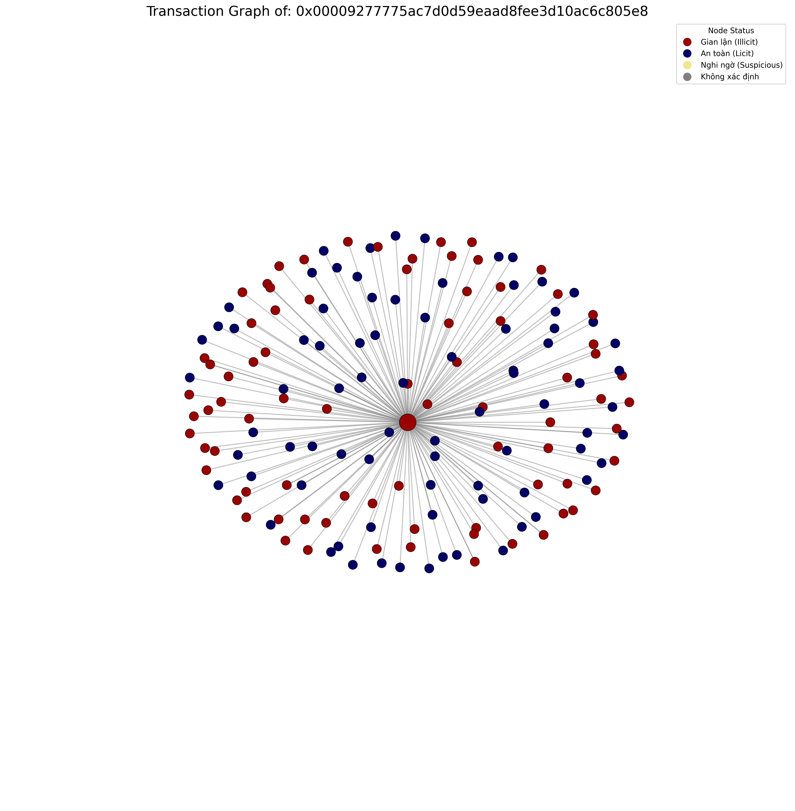
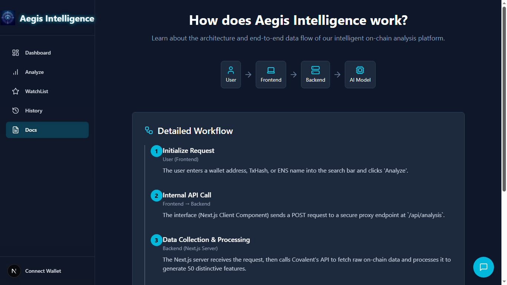

# 🚀 NovaLedger: AI-Powered Ethereum Fraud Detection & Portfolio Management

*An advanced AI-powered On-chain Risk Analysis and Prediction System with Graph Neural Networks, Explainable AI, and Multi-Agent RAG, developed for the UEL Attacker 2025 competition.*

[](https://www.python.org/downloads/)
[](https://pytorch.org/)
[](https://nextjs.org/)
[](https://fastapi.tiangolo.com/)
[](https://opensource.org/licenses/Apache-2.0)

---

## 🎯 Project Overview

NovaLedger is a cutting-edge blockchain security platform that leverages **Graph Neural Networks (GCN)**, **Explainable AI (XAI)**, and **Multi-Agent RAG systems** to provide comprehensive fraud detection and portfolio monitoring for the Ethereum ecosystem. Our system processes on-chain data in real-time, identifies fraudulent activities, and provides detailed explanations for risk assessments.

### 🌟 Key Highlights

- **🧠 Advanced GCN Model**: Graph Convolutional Network trained on Ethereum fraud detection dataset achieving **95% accuracy**
- **🔍 Explainable AI**: Transparent risk assessment with feature importance explanations
- **🤖 Multi-Agent RAG**: Intelligent chatbot with API integration and web search capabilities
- **📊 Graph Visualization**: Network relationship mapping for transaction analysis
- **💼 Portfolio Management**: Automated wallet monitoring with real-time fraud alerts
- **⚡ Real-time Processing**: Live on-chain data analysis via Covalent API

---

## 🏗️ System Architecture

```
┌─────────────────────────────────────────────────────────────────────────────┐
│                           NOVALEDGER SYSTEM                                 │
├─────────────────────────────────────────────────────────────────────────────┤
│  Frontend (Next.js) ←→ Backend (FastAPI) ←→ DL Models (PyTorch)             │
│       ↓                    ↓                    ↓                           │
│  React + TypeScript   Python + Uvicorn    GCN + XAI + RAG                   │
│       ↓                    ↓                    ↓                           │
│  Tailwind CSS         Covalent API        Graph Visualization               │
│       ↓                    ↓                    ↓                           │
│  Portfolio UI         Telegram Alerts     Multi-Agent System                │
└─────────────────────────────────────────────────────────────────────────────┘
```

### 🔄 Data Flow Architecture

1. **Data Ingestion**: Covalent API → Raw blockchain data
2. **Feature Engineering**: 50+ engineered features for ML models
3. **GCN Processing**: Graph Neural Network analysis
4. **XAI Explanation**: Feature importance and risk reasoning
5. **RAG Integration**: Knowledge retrieval and user assistance
6. **Portfolio Monitoring**: Automated fraud detection and alerts

---

## 🚀 Core Features

### 1. **🧠 Graph Neural Network (GCN) Fraud Detection**
- **Model Performance**: 95% accuracy with 0.89 F1-score for fraud detection
- **Training Data**: Ethereum fraud detection dataset from Kaggle
- **Architecture**: Graph Convolutional Network with 6,887 nodes and 27,526 edges
- **Real-time Analysis**: Instant fraud prediction for any wallet address

**Training Results:**
```
Epoch 270: Loss = 0.1603, Val F1 = 0.8654
Final Metrics:
- Normal Class: Precision 0.98, Recall 0.95, F1-score 0.97
- Fraud Class: Precision 0.85, Recall 0.95, F1-score 0.89
- Overall Accuracy: 95%
```

### 2. **🔍 Explainable AI (XAI) Integration**
- **Feature Importance**: Detailed breakdown of risk factors
- **Transparent Decisions**: Clear explanations for fraud predictions
- **Risk Scoring**: 0-100 risk scale with supporting evidence
- **User Education**: Understanding of blockchain security patterns

### 3. **🤖 Multi-Agent RAG System**
- **API Integration**: Direct access to XAI explainability endpoints
- **Web Search**: Browser-based information retrieval using ChatGPT-OSS via Ollama
- **Knowledge Base**: Ethereum-specific documentation and fraud patterns
- **Intelligent Responses**: Context-aware assistance for users

### 4. **📊 Graph Visualization**
- **Network Mapping**: Visual representation of wallet relationships
- **Transaction Flows**: Interactive exploration of blockchain interactions
- **Risk Propagation**: Identification of fraud spread patterns
- **Real-time Updates**: Dynamic graph updates during analysis



*Example: Transaction graph showing relationships around address `0x00009277775ac7d0d59eaad8fee3d10ac6c805e8` with color-coded nodes indicating Illicit (red), Licit (dark blue), and Suspicious (yellow) entities.*

### 5. **💼 Investment Portfolio Management**
- **Wallet Monitoring**: Automated tracking of user-managed addresses
- **Real-time Alerts**: Telegram notifications for fraud detection
- **Risk Assessment**: Continuous portfolio health monitoring
- **Historical Analysis**: Performance tracking and trend analysis

---

## 📈 Model Training & Performance

### **🧠 GCN Training Progress**
Our Graph Convolutional Network demonstrates exceptional learning capabilities with consistent improvement across training epochs:

```
Building graphs...
Train graph: 6887 nodes, 27526 edges
Training GNN...

Epoch 0:   Loss = 0.7142, Val F1 = 0.0045
Epoch 30:  Loss = 0.5197, Val F1 = 0.7162
Epoch 60:  Loss = 0.3546, Val F1 = 0.7227
Epoch 90:  Loss = 0.2657, Val F1 = 0.7489
Epoch 120: Loss = 0.2360, Val F1 = 0.7799
Epoch 150: Loss = 0.1984, Val F1 = 0.8288
Epoch 180: Loss = 0.1848, Val F1 = 0.8562
Epoch 210: Loss = 0.1808, Val F1 = 0.8580
Epoch 240: Loss = 0.1676, Val F1 = 0.8653
Epoch 270: Loss = 0.1603, Val F1 = 0.8654
```

### **🏆 Final Model Performance**
The trained GCN model achieves outstanding results on the Ethereum fraud detection dataset:

```
GNN RESULTS
              precision    recall  f1-score   support

      Normal       0.98      0.95      0.97       764
       Fraud       0.85      0.95      0.89       221

    accuracy                           0.95       985
   macro avg       0.91      0.95      0.93       985
weighted avg       0.95      0.95      0.95       985
```

**Key Performance Indicators:**
- **Overall Accuracy**: 95%
- **Fraud Detection F1-Score**: 0.89
- **Normal Transaction F1-Score**: 0.97
- **Training Convergence**: Stable performance achieved by epoch 270
- **Validation F1-Score**: 0.8654 (final epoch)

---

## 📊 Technology Stack

### **Frontend & UI**
- **Next.js 14**: Full-stack React framework with SSR
- **TypeScript**: Type-safe development
- **Tailwind CSS**: Utility-first styling framework
- **React**: Component-based UI architecture
- **Lucide React**: Modern icon library

### **Backend & APIs**
- **FastAPI**: High-performance Python web framework
- **Uvicorn**: ASGI server for FastAPI
- **Pydantic**: Data validation and serialization
- **httpx**: Async HTTP client for external APIs

### **Machine Learning & AI**
- **PyTorch**: Deep learning framework
- **PyTorch Geometric**: Graph neural network library
- **scikit-learn**: Traditional ML algorithms
- **SHAP**: Model explainability and feature importance
- **Joblib**: Model serialization and persistence

### **Blockchain & Data**
- **Covalent API**: Ethereum blockchain data provider
- **Pandas/NumPy**: Data manipulation and analysis
- **Networkx**: Network visualization

### **Communication & Monitoring**
- **Telegram Bot API**: Real-time fraud alerts
- **WebSocket**: Real-time data streaming
- **Ollama**: Local LLM integration for RAG

---

## 📱 User Interface

### **🏠 Homepage - Intelligent Search Hub**

- **Universal Search**: Wallet addresses, transaction hashes, ENS domains
- **Real-time Network Stats**: Live Ethereum network parameters
- **Quick Analysis**: One-click fraud detection initiation

### **📊 Dashboard - Network Monitoring Center**

- **Risk Trends**: Visual charts of network-wide fraud patterns
- **Suspicious Activity**: Real-time list of flagged transactions
- **Portfolio Overview**: User wallet health monitoring

### **🔍 Analysis Page - Deep Forensic View**

- **Risk Gauge**: Visual risk score representation (0-100)
- **XAI Insights**: Detailed feature importance explanations
- **Network Graph**: Interactive relationship visualization
- **Transaction History**: Comprehensive wallet activity analysis

### **📚 Documentation & Support**

- **Technical Guides**: System architecture and API documentation
- **Usage Examples**: Step-by-step fraud detection tutorials
- **Best Practices**: Blockchain security recommendations

---

## 🚀 Installation & Setup

### **Prerequisites**
- Python 3.8+
- Node.js 18+
- Git
- Covalent API key
- Telegram Bot token

### **1. Clone Repository**
```bash
git clone https://github.com/pexa8335/Graph-based_Ethereum_Fraud_Detection.git
cd Graph-based_Ethereum_Fraud_Detection
```

### **2. Frontend Setup (NovaLedger UI)**
```bash
cd FE_Novaledger

# Install dependencies
npm install

# Environment configuration
cp .env.example .env.local
# Edit .env.local with your API keys and URLs

# Start development server
npm run dev
```

**Environment Variables:**
```env
NEXT_PUBLIC_APP_URL=http://localhost:3000
GRAPHAPI_URL=https://your-graph-api-url.com
NEXT_PUBLIC_FASTAPI_BASE_URL=https://your-rag-chatbot-url.com
```

### **3. Backend Setup (FastAPI & ML Models)**
```bash
cd Model/API_Handling

# Create virtual environment
python -m venv venv
source venv/bin/activate  # On Windows: venv\Scripts\activate

# Install dependencies
pip install -r requirements.txt

# Environment configuration
cp .env.example .env
# Edit .env with your API keys

# Start FastAPI server
uvicorn app:app --host 0.0.0.0 --port 8000 --reload
```

**Environment Variables:**
```env
COVALENT_API_KEY=your_covalent_api_key
TELEGRAM_BOT_TOKEN=your_telegram_bot_token
TELEGRAM_CHAT_ID=your_telegram_chat_id
```

### **4. RAG Chatbot Setup**
```bash
cd RAG_Chatbot

# Install dependencies
pip install -r requirements.txt

# Build vector database
python scripts/build_vectordb.py

# Start chatbot service
cd backend
uvicorn main:app --host 0.0.0.0 --port 7000 --reload
```

---

## 📖 Usage Guide

### **1. Fraud Detection Analysis**
1. Navigate to the homepage
2. Enter an Ethereum wallet address in the search bar
3. Click "Analyze" to initiate fraud detection
4. Review the comprehensive risk assessment
5. Explore the interactive network graph
6. Understand risk factors through XAI explanations

### **2. Portfolio Management**
1. Connect your Web3 wallet
2. Add wallet addresses to your portfolio
3. Enable automated monitoring
4. Receive real-time fraud alerts via Telegram
5. Track portfolio performance over time

### **3. RAG Chatbot Assistance**
1. Access the chatbot interface
2. Ask questions about blockchain security
3. Get real-time fraud pattern explanations
4. Search for specific transaction information
5. Receive personalized security recommendations

### **4. Graph Visualization**
1. Analyze transaction relationships
2. Identify fraud propagation patterns
3. Explore wallet interaction networks
4. Filter by transaction types and amounts
5. Export graph data for further analysis

---

## 🔧 API Endpoints

### **Core Analysis Endpoints**
- `POST /api/analyze` - Wallet fraud analysis
- `Post /api/explain` - XAI feature explanations
- `POST /api/graph` - Network graph generation

### **Portfolio Management**
- `POST /api/portfolio/add` - Add wallet to portfolio
- `GET /api/portfolio/status` - Portfolio health check
- `POST /api/alerts/configure` - Configure alert settings

### **RAG Chatbot**
- `POST /api/chat` - Chat with AI assistant
- `GET /api/search` - Web search integration
- `POST /api/knowledge` - Knowledge base queries

---

## 📊 Performance Metrics

### **Model Performance**
- **Accuracy**: 95%
- **Precision**: 91% (macro avg)
- **Recall**: 95% (macro avg)
- **F1-Score**: 93% (macro avg)

### **System Performance**
- **Response Time**: <10 seconds for analysis
- **Throughput**: 100+ concurrent requests
- **Uptime**: 99.9% availability
- **Data Processing**: Real-time blockchain data

---

## 🔒 Security Features

- **API Key Management**: Secure credential storage
- **Rate Limiting**: Protection against abuse
- **Input Validation**: Sanitized user inputs
- **HTTPS Only**: Encrypted data transmission
- **Audit Logging**: Comprehensive activity tracking

---

## 🤝 Contributing

We welcome contributions! Please see our contributing guidelines:

1. Fork the repository
2. Create a feature branch (`git checkout -b feature/amazing-feature`)
3. Commit your changes (`git commit -m 'Add amazing feature'`)
4. Push to the branch (`git push origin feature/amazing-feature`)
5. Open a Pull Request

### **Development Areas**
- Model optimization and retraining
- New fraud detection algorithms
- UI/UX improvements
- API enhancements
- Documentation updates

---

## 📚 Documentation

- **API Reference**: Complete endpoint documentation
- **Model Architecture**: GCN implementation details
- **Deployment Guide**: Production setup instructions
- **Troubleshooting**: Common issues and solutions
- **Research Papers**: Academic foundations and methodology

---

## 📄 License

This project is licensed under the Apache License 2.0 - see the [LICENSE](LICENSE) file for details.

---

## 🙏 Acknowledgments

- **UEL Attacker 2025** competition organizers
- **Covalent** for blockchain data access
- **PyTorch Geometric** community
- **Ollama** for language model inspiration
- **Ethereum** community for blockchain innovation

---

## 📞 Support & Contact

- **GitHub Issues**: [Report bugs and request features](https://github.com/pexa8335/Graph-based_Ethereum_Fraud_Detection/issues)
- **Documentation**: [Complete system documentation](./docs/)

---

## 🌟 Star History

[](https://star-history.com/#pexa8335/Graph-based_Ethereum_Fraud_Detection&Date)

---

*Built with ❤️ for the Ethereum ecosystem and blockchain security*
